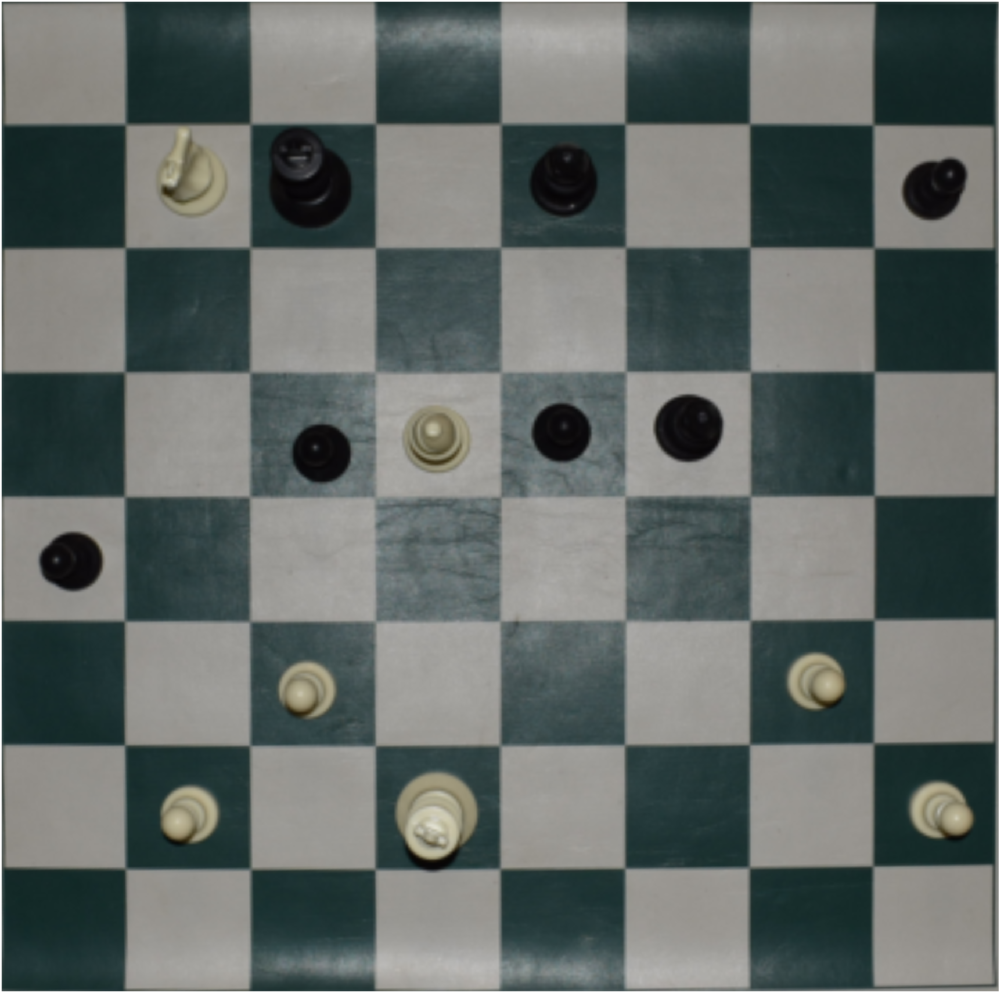

# Chess Board Dataset

## Description:
500 photos of chess boards labeled with [Forsyth–Edwards Notation](https://en.wikipedia.org/wiki/Forsyth%E2%80%93Edwards_Notation
 "") for use in image classification.
 
 Includes both raw images and preprocessed images. More info on preprocessing can be found [here](https://github.com/samryan18/chess-ray-vision
 "").

 ## Example Original and Preprocessed
 

 
